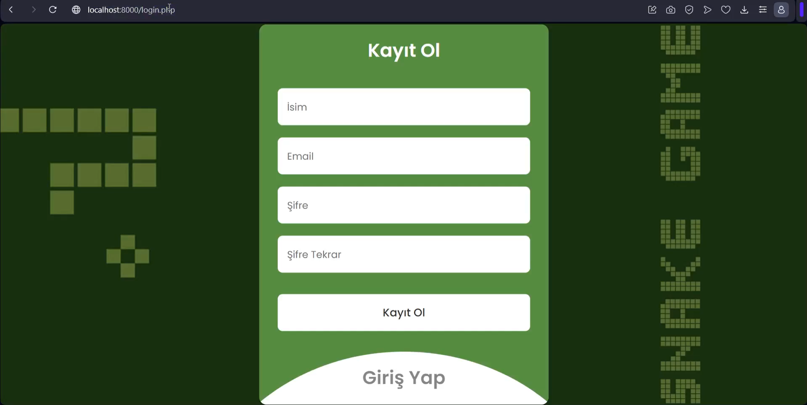
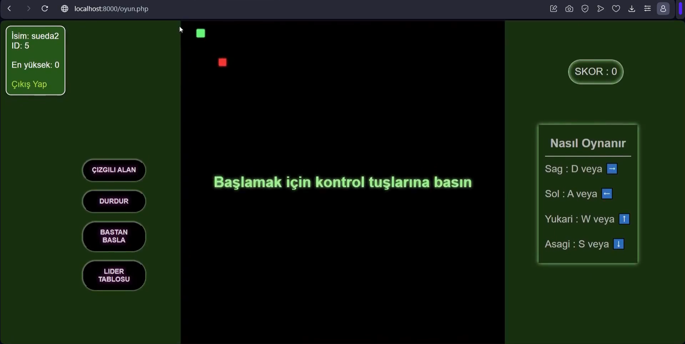

# Bulut Bilisimde Sanallastirma Teknolojilerine Giris Dersi Proje

Bu proje için web tabanlı bir yılan oyunu geliştirilmiştir. Bu oyunu oynamak için kullanıcı hesabı açılabilmekte olup bu hesaba ait en yüksek skor ve hesap bilgileri phpmyadmin aracılığıyla mysql veritabanında tutulmaktadır. Bu tutulan bilgilerle de bir leaderboard oluşturulmuştur. Bu proje Docker kullanılarak konteynerlaştırılmış, bu konteynerlar AWS bulut sağlayıcısına yüklenmiş ve proje sanallaştırılmıştır. Detaylar proje raporunda açıklanmıştır.

    
    
    

